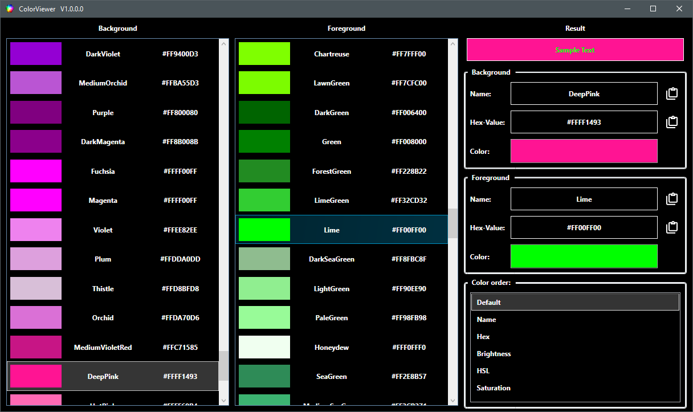
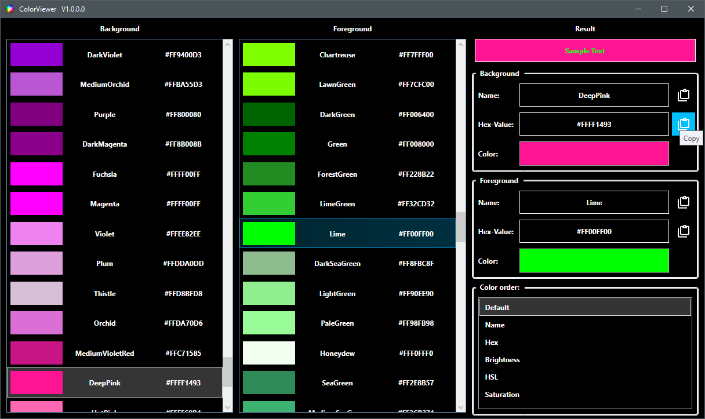

# ColorViewer
A simple tool to get a look at what various color combinations (background and foreground) may look like.
// https://pixieditor.net/colorpicker

There is also a possibility to copy either the name or the representative hex-value of the selected color (more or less simultaneously for the background and the foreground color).

